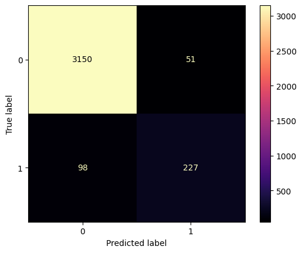

# Results Interpretation:

## 1. What is the LLR (Log Likelihood Ratio) p-value in the summary of the logistic regression model, and what does it tell us?

A: The LLR p-value < 0.001, means that the improvement is statistically significant.

It indicates that the full model provides a significantly better fit to the data than the null model. This suggests that the predictors, collectively, are highly effective in explaining the outcome variable.

## 2. Which are the features that influence the decision in the decision tree model?

A: 'days_on_platform' and 'minutes_watched' are the features that influenced decisions in the decision tree model.

## 3. What observations and conclusions can you make based on the confusion matrices? Does the accuracy of the model determine its predictive power?

A: From observing the classification report of each model it can be concluded that accuracy of the model doesn't determine the predictive power. The models are performing well in predicting the 'Not purchased' class but isn't functioning as well with the 'purchased' class.

All the models provide accuracy score of 96%. However, only Random Forest and Decision Tree models are reaching a recall score of 75% for the 'purchased' class with a precision of above 80% for this class. They are the best performer.

See the data below:

## Logistic Regression

               precision    recall  f1-score   support

Not purchased       0.97      0.99      0.98      3201
    purchased       0.82      0.67      0.74       325

     accuracy                           0.96      3526
    macro avg       0.89      0.83      0.86      3526
 weighted avg       0.95      0.96      0.95      3526

## K-neighbors

               precision    recall  f1-score   support

Not Purchased       0.97      0.98      0.98      3201
    Purchased       0.79      0.71      0.75       325

     accuracy                           0.96      3526
    macro avg       0.88      0.85      0.86      3526
 weighted avg       0.95      0.96      0.95      3526

## Support Vector Machine

               precision    recall  f1-score   support

Not purchased       0.97      0.98      0.98      3201
    purchased       0.82      0.70      0.75       325

     accuracy                           0.96      3526
    macro avg       0.89      0.84      0.86      3526
 weighted avg       0.96      0.96      0.96      3526

## Decision tree

               precision    recall  f1-score   support

Not purchased       0.98      0.98      0.98      3201
    purchased       0.81      0.76      0.78       325

     accuracy                           0.96      3526
    macro avg       0.90      0.87      0.88      3526
 weighted avg       0.96      0.96      0.96      3526

## Random forest

               precision    recall  f1-score   support

Not purchased       0.98      0.98      0.98      3201
    purchased       0.83      0.75      0.79       325

     accuracy                           0.96      3526
    macro avg       0.90      0.87      0.89      3526
 weighted avg       0.96      0.96      0.96      3526

## 4. How can we use the results from the models?

A: From the Decision Tree model we discovered that the main features used for making the decisions were 'days_on_platform' and 'minutes_watched'. 

Specifically, users with less values of 'days_on_platform' and 'minutes_watched' were more likely to make a purchase. This indicates that new users of the platform are more likely to be converted into a paid customer while they are still a fresh user. 

This also makes sense intuitively, the users with high values of 'days_on_platform' and 'minutes_watched' are likely to be users taking advantage of free offers, trying to binge as much content as possible as soon as possible.

Based on this information, it is recommended to have an email campaign targeting the new users with strong CTAs and limited offers available for only the first 48 hours.

## 5. What actions can we undertake to improve the models?

A: In order to improve the models it is recommended to increase the size of dataset, we need to gather more data to increase the predictive power of the model. 

Additionally, it would be interesting to get data from marketing to understand:
- what is the origin of the user (source of lead)? 
- what kind of offers, communications has been sent to the users who made purchases?
- at what pace did these communications take place?